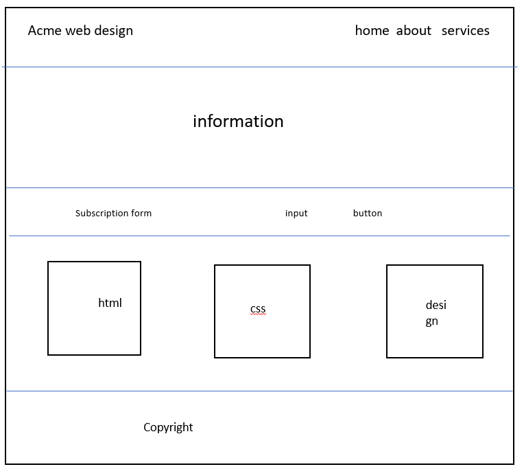

# Development Strategy

> `ACME-WEB-DESIGN`

## Wireframe

## 0. Set-Up

__A User can see my [initial repository](https://github.com/DIVYASREE345/acme-web-design) and [live demo](https://divyasree345.github.io/acme-web-design/.)__

### Repo

- Generate from Template
- Write initial, basic README
- Turn on GitHub Pages

## STEP-1 
In this step basic page layout for 3 pages are being created.

### Repo

> *branch name:* 1-basic-layout
---
starting to code basic features like header, nav, subscription, footer which is common for 3 pages. 

### HTML

adding header,nav,subscription,footer in each page.

### CSS

styling of html contents stated above

## STEP-2
in this step focused on index page

### Repo
> *branch name:* 2-index
---
### HTML
adding the showcase and 3 boxes of services

### CSS
styling of html contents stated above.

## STEP-3
developing about.html page
### Repo
> *branch-name:* 3-about

### HTML
adding the sidebar,article

### CSS

styling of html contents stated above.

## Finishing Touches

- Write final, complete README:
  - [makeareadme.com](https://www.makeareadme.com/)
  - [bulldogjob](https://bulldogjob.com/news/449-how-to-write-a-good-readme-for-your-github-project)
  - [meakaakka](https://medium.com/@meakaakka/a-beginners-guide-to-writing-a-kickass-readme-7ac01da88ab3)
- Validate code to check for any last mistakes
